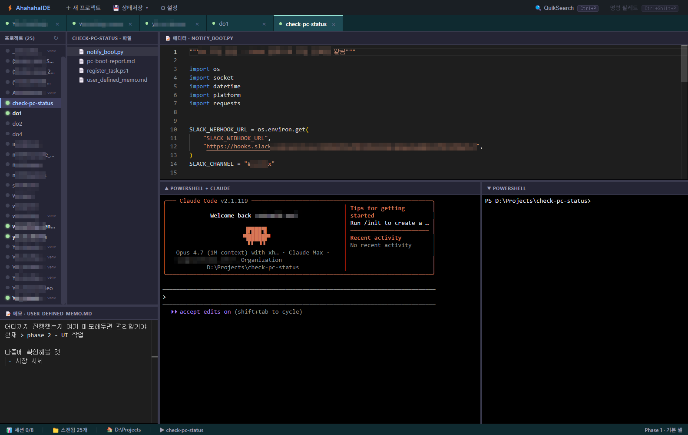

# AhahahaIDE

[](https://github.com/ramenshin/AhahahaIDE/actions/workflows/ci.yml)
[](LICENSE)
[](#platform-support)
[](.)

A personal IDE for multi-project [Claude Code](https://docs.claude.com/en/docs/claude-code) workflows. **Built for Windows.**

> 🇰🇷 [한국어 README](README.ko.md)

AhahahaIDE wraps the Claude CLI and PowerShell sessions into a single Electron-based IDE: file tree, Monaco editor, project memo, multi-project tabs, fuzzy file/content search (QuikSearch), and one-click "save state" across editors and Claude sessions.

## Screenshots

<p align="center"></p>

---

## Platform Support

**Windows 10 / 11 only.** macOS and Linux are **not supported** — the app refuses to launch on other platforms.

Cross-platform support is welcome as a community contribution but is not maintained by the project author. See [CONTRIBUTING.md](CONTRIBUTING.md).

## Features

- 🔀 **Multi-project tabs** — open multiple projects simultaneously, each with its own Claude + PowerShell PTY session
- 📝 **Monaco editor** — syntax highlighting for ~30 languages, Ctrl+S save, dirty tracking
- 📓 **Per-project memo** — `user_defined_memo.md` automatically loaded/saved per project
- 🔍 **QuikSearch** — `Ctrl+P` for fuzzy file-name search; `Ctrl+Shift+F` for content search across all projects (`.txt` / `.md` / `.pdf` for documents; ~35 code extensions)
- 💾 **State save** — flush editors and instruct Claude sessions to checkpoint progress (per-project or all open projects)
- 🎨 **8 color themes**, **3 layout modes** (rows / columns / hybrid), configurable zoom (80–150%)
- ⚙️ **Settings UI** — root path, exclusion patterns, max sessions, layout, theme

## Requirements

### To run
- **Windows 10 / 11** (other operating systems are not supported)
- **[Claude CLI](https://docs.claude.com/en/docs/claude-code/quickstart)** installed and authenticated (`claude` must be on `PATH`; run `claude login` once)
- **PowerShell 5.1+** (default on Windows 10 / 11)

### To develop
- **Node.js 20+**
- **npm 10+**

## Installation

### From Releases (recommended)

1. Download the latest `AhahahaIDE-Setup-x.y.z.exe` from [Releases](https://github.com/ramenshin/AhahahaIDE/releases)
2. Run the installer. You may see a Windows SmartScreen warning ("Windows protected your PC") since the binary is not yet code-signed — click **More info → Run anyway**
3. Launch from the Start Menu

### From source

```bash
git clone https://github.com/ramenshin/AhahahaIDE.git
cd AhahahaIDE
npm install
npm run dev
```

## Quick Start

On first launch, AhahahaIDE asks you to choose a **projects root folder** (e.g., `C:\Users\You\Projects`). All immediate subfolders of that root are listed as projects.

1. **Click a project** in the left tree — opens a tab with Claude + PowerShell sessions
2. **Click a file** in the file explorer — opens in the Monaco editor
3. **`Ctrl+P`** — fuzzy search file names across all projects
4. **`Ctrl+Shift+F`** — search inside documents
5. **⚙ Settings** — change theme, root path, max sessions, layout

## Architecture

| Layer | Tech | Notes |
|---|---|---|
| Main | Electron + Node.js | PTY (`node-pty`), file system, IPC handlers, config storage |
| Preload | Context bridge | Exposes `window.api.*` to renderer |
| Renderer | React + Vite | Monaco editor, xterm.js, react-resizable-panels |

Config is stored at `%APPDATA%\AhahahaIDE\config.json` by default. Override with the `AHAHAHAIDE_CONFIG_DIR` environment variable.

## Development

```bash
npm run dev          # Start dev server with hot reload
npm run typecheck    # TypeScript check (main + renderer)
npm run dist         # Build NSIS installer (Windows only)
```

See [CONTRIBUTING.md](CONTRIBUTING.md) for code style, commit conventions, and PR workflow.

## Project Status

AhahahaIDE is a **personal project** maintained by a single author in their spare time. Response times to issues and PRs may vary. Bug reports and pull requests are welcome — see [Issues](https://github.com/ramenshin/AhahahaIDE/issues).

This is **alpha-quality software**. Backups of important work are recommended.

## Acknowledgments

- [Anthropic Claude](https://www.anthropic.com/) for the Claude CLI this IDE wraps
- [Electron](https://www.electronjs.org/) for the desktop runtime
- [Monaco Editor](https://microsoft.github.io/monaco-editor/) for code editing
- [xterm.js](https://xtermjs.org/) for terminal rendering
- [node-pty](https://github.com/microsoft/node-pty) for pseudo-terminal support
- [pdf-parse](https://www.npmjs.com/package/pdf-parse) for PDF text extraction in QuikSearch

## License

AhahahaIDE is licensed under the **[GNU General Public License v3.0 or later](LICENSE)**.

This is a copyleft license: you are free to use, modify, and redistribute this
software, but any derivative works you distribute must also be licensed under
the GPL-3.0 (or later). See [LICENSE](LICENSE) for the full text.

Copyright © 2026 ramenshin
